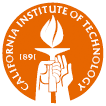
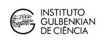
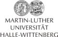
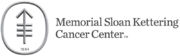
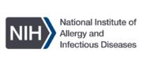
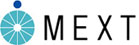

+++ # -*- mode: markdown -*-
#=====================================================================
# File:    about/funding/_index.md
# Summary: This file defines the content of the /about/funding page.
#---------------------------------------------------------------------
title = "SBML funding and support"
widget = ""
layout = "single"
#=====================================================================
+++

This page lists groups that have supported and funded SBML development in a direct capacity. Even more groups have supported SBML by developing compatible software, using SBML in their research, writing publications that use SBML, and promoting SBML's use in other ways. It is truly a community effort!

## Current SBML Funded Partners

The following groups are supported directly for core SBML development via the main SBML grant from the US National Institute of General Medical Sciences.

  

  
  <strong>Hucka Group</strong> 
  Computing + Mathematical Sciences 
  California Institute of Technology 
  Pasadena, California 
  US
  

  

  
  <strong>Kummer Group</strong> 
  BioQUANT/COS 
  University of Heidelberg 
  Heidelberg 
  Germany
  

  

  
   
  <strong>Dräger Group</strong> 
  Center for Bioinformatics (ZBIT) 
  University of Tuebingen 
  Tübingen 
  Germany 
  

Past funded partners have been the Kitano group at the [Systems Biology Institute](http://sbi.jp) (Japan), the Bolouri group at the [University of Hertfordshire](http://strc.herts.ac.uk/bio/) (UK), and the Brent group at the [Molecular Sciences Institute](http://molsci.org/) (US).

## Other SBML support

Many institutions have hosted SBML events, supported students working on SBML-related projects, and otherwise indirectly supported SBML over the years. Below are listed as many as we can identify. We apologize if we missed any—please notify us if you find any omissions.

<table class="no-striping no-borders tight-spacing" width="98%" align="center" style="margin-top: 1em">
  <tr>
    <td width="120px" align="center">  
    </td><td width="120px" align="center">  
    </td><td width="240px" align="center" colspan="2">  
    </td></tr>
  <tr>
    <td width="120px" align="center">  
    </td><td width="120px" align="center">  
    </td><td width="150px" align="center" colspan="2"> 
    </td></tr>
  <tr>
    <td width="120px" align="center" colspan="2">  
    </td><td width="120px" align="center">  
    </td><td width="60px" align="center">  
    </td></tr>
  <tr>
    <td width="120px" align="center">  
    </td><td width="120px" align="center">   
    </td><td width="120px" align="center">  
    </td><td width="120px" align="center">  
    </td></tr>
  <tr>
    <td width="120px" align="center">  
    </td><td width="120px" align="center">   
    </td><td width="120px" align="center">  
    </td><td width="120px" align="center">  
    </td></tr>
  <tr>
    <td width="120px" align="center">  
    </td><td width="120px" align="center">  
    </td><td width="120px" align="center" colspan="2">  
    </td></tr>
  <tr>
    <td width="120px" align="center">  
    </td><td width="120px" align="center">  
    </td><td width="120px" align="center">  
    </td><td width="120px" align="center">  
    </td></tr>
  <tr>
    <td width="120px" align="center">  
    </td><td width="120px" align="center"> 
    </td><td width="120px" align="center">  
    </td><td width="120px" align="center">  
    </td></tr>
  <tr>
    <td width="120px" align="center">  
    </td><td width="120px" align="center">   
    </td><td width="120px" align="center">  
    </td><td width="120px" align="center">  
    </td></tr>
  <tr>
    <td width="120px" align="center">  
    </td><td width="120px" align="center">  
    </td><td width="120px" align="center">  
    </td></tr>
</table>

## Past SBML funding

We are deeply indebted to the many funding agencies and organizations that have provided funding for SBML in the past.

The core development of SBML from its inception through 2003 was principally funded by the [Japan Science and Technology Agency](http://www.jst.go.jp/EN/) under the [ERATO Kitano Symbiotic Systems Project](http://www.symbio.jst.go.jp/symbio), with funding going to the group of [John Doyle](http://www.cds.caltech.edu/~doyle/) at Caltech. After 2003, primary direct support for the core development of SBML and supporting software and activities has come from the [National Institute of General Medical Sciences (NIH/NIGMS)](http://www.nigms.nih.gov/) under grants R01 GM070923 and R01GM077671. Additional support has come from the following agencies and programs: the [National Human Genome Research Institute](http://www.genome.gov/) (USA), the [International Joint Research Program of NEDO](http://www.nedo.go.jp/) (Japan), the [ERATO-SORST](http://www.jst.go.jp/kisoken/sorst/) Program of the Japan Science and Technology Agency (Japan), the [Ministry of Agriculture](http://www.maff.go.jp/eindex.html) (Japan), the [Ministry of Education, Culture, Sports, Science and Technology](http://www.mext.go.jp/) (Japan), the [BBSRC e-Science Initiative](http://www.bbsrc.ac.uk/) (UK), the [DARPA IPTO Bio-Computation Program](http://www.darpa.mil/ipto/programs/biocomp/vision.htm) (USA), the Army Research Office's [Institute for Collaborative Biotechnologies](https://www.icb.ucsb.edu) (USA), the [Air Force Office of Scientific Research](http://www.afosr.af.mil/) (USA), the [EU Commission 6th Framework Programme](http://ec.europa.eu/research/fp6/index_en.cfm), the [European Commision's 7th Framework Programme for Research and Technological Development](http://systemsbiology.ucsd.edu/projects/AMBiCon), the [Federal Ministry of Education and Research (BMBF, Germany)](https://www.bmbf.de/en/index.html), the [Virtual Liver Network](http://www.virtual-liver.de), the [Systems Biology Institute](http://systems-biology.org/) (Japan), and [Google Summer of Code](https://developers.google.com/open-source/gsoc/).

<table class="no-striping no-borders" width="90%" align="center" style="margin: 1rem auto 2rem auto">
<tr>
<td width="150px" align="center"> 
</td><td width="150px" align="center"> 
</td><td width="150px" align="center"> 
</td><td width="150px" align="center"> 
</td></tr>
<tr>
<td width="150px" align="center"> 
</td><td width="150px" align="center"> 
</td><td width="150px" align="center"> 
</td><td width="150px" align="center"> 
</td></tr>
<tr>
<td width="150px" align="center"> 
</td><td width="150px" align="center"> 
</td><td width="150px" align="center"> 
</td><td width="150px" align="center"> 
</td></tr>
<tr>
<td width="150px" align="center"> 
</td><td width="150px" align="center"> 
</td><td width="150px" align="top"> 
</td><td width="150px" align="center"> 
</td></tr>
</table>
