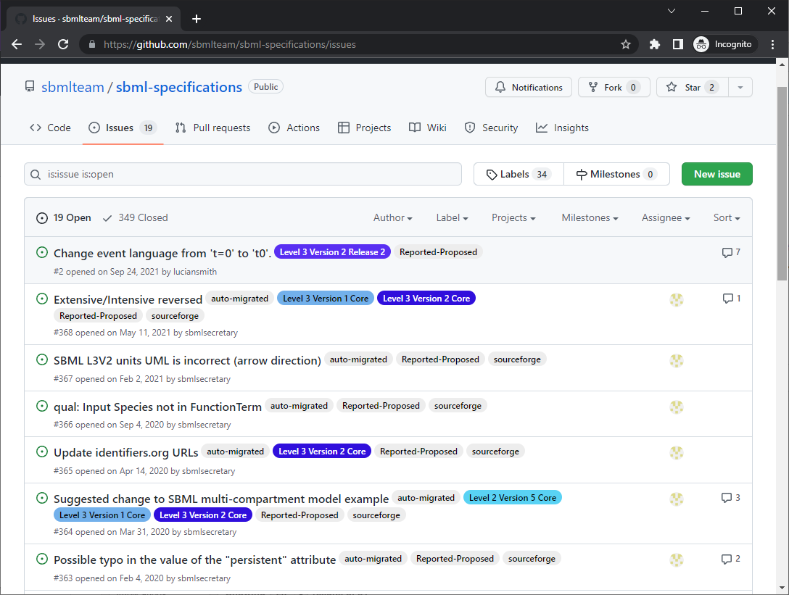
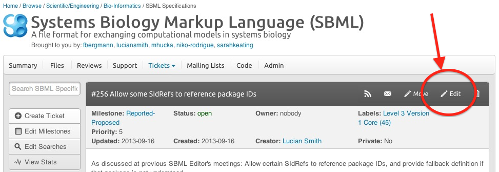
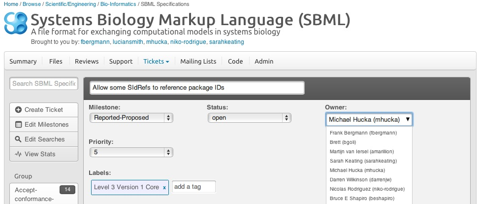

+++ # -*- mode: markdown -*-
######################################################################
title = "SBML Editors' process for handling issue reports"
date  = 2019-04-07
######################################################################
+++

**Procedure version of 2016-04-18**

Anyone (whether they are a member of the SBML Forum or not) may raise an issue or record a request using the reporting system at <http://sbml.org/issue-tracker>. The tracker is hosted on SourceForge.net as part of the [SBML project](http://sourceforge.net/projects/sbml). As much as possible, the [SBML Editors](/about) also use the tracker to log issues and discussions about those issues.

## Sequence

The following is the intended sequence of events in the life of an issue.

1.  **Preliminary actions**:
    1.  The issue is entered into the tracking system by someone. The SourceForge tracking system defaults new issues to a status of *Open* and to the "Milestone" *Reported/Proposed*. The SBML Editors mailing list will be automatically notified of the new issue.
    2.  The first available person from the SBML Editors or from the SBML Team to examine the report will do a preliminary evaluation of whether the issue is genuine. Spam may be dealt with by changing the issue's "Milestone" to *Rejected-No\_action*, setting the status to *closed*, and checking the "Mark as Private" box. Otherwise, they may change the issue's *Owner* field to their name, signifying that the issue is genuine, and beginning to moderate discussion among the SBML Editors in analyzing and discussing the issue. Editing the issue can be done by clicking on the Edit button in the dark bar above the issue description:
    
    
then

    

2.  **Evaluation and discussion**:
    1.  The Editors will begin by investigating whether the issue is new or not. If not, the "Milestone" is changed to *Closed - Duplicate*, and the status is changed to *closed*.
    2.  The Owner will lead the SBML Editors in discussing the issue and how to resolve it. Generally this takes place by attaching comments in the tracking system, but sometimes (especially when there is a lot of uncertainty or there needs to be exploration of wider implications), the discussions may take place on the SBML Editors' internal mailing list. In the latter case, it is the Owner Editor's responsibility to try to summarize or otherwise enter back into the tracking system as much relevant information as possible, so that the issue history reflects the reasoning and rationales for whatever decisions are ultimately made.
    3.  Editors can indicate at any time their acceptance of a proposed action or rejection. New solutions to the issue may also be proposed.
3.  **Resolution**:
    1.  The case of simple matters such as typographical or formatting errors do not require a majority; they can be acted upon by a single Editor and the issue closed by that Editor after they made the relevant change(s). If any other Editors disagree with the action, they can reopen the issue and call for the issue to follow the process below.
    2.  In other cases, a majority consensus will eventually arise from the editors. A supermajority of 4 out of 5 editors is preferred, but some issues may become stalemated at a 3 out of 5 majority.  In those cases, the Chair's opinion should be included in the discussion, and if the 2 minority-opinion Editors wish, the community may be polled via the sbml-discuss mailing list.
          - If the Chair or any of the Editors call for closure on an issue where consensus has not been reached, then Editors should make their opinions known within two weeks of the call for closure. If a majority opinion has not been reached by the end of two weeks, the Chair's vote may be counted as the tie-breaking vote in the event of a tie. The minority-opinion Editor(s) may still request that the community be polled on the issue.
    3.  Once a conclusion has been reached (whether by votes or by polling the community), if the conclusion is to accept the issue and make a change, the Owner will change the issue's "Milestone" to one of the *Accepted* groups, and change the status from *Open* to *Accepted*. There are three versions:
          - *Accepted: Formatting/non-content editing*: These are formatting or other issues that do no fundamentally change any textual content of the specification document.
          - *Accepted: Changes without conformance implications*: These are issues that change the text, but do not affect SBML software in a way that may alter their conformance with the SBML specification. For example, a change to some terminology in SBML would not fundamentally change the mathematics of a model, and therefore would not be considered a change having conformance implications.
          - *Accepted: Changes with conformance implications*: These are changes that *do* affect the conformance of software reading, writing and/or processing data in SBML format.
    4.  On the other hand, if the conclusion is to make no change, the Owner will change the issue's "Milestone" to *Rejected-No\_action* and change its "Status" to *Closed*.
4.  **Post-resolution**:
    1.  Every accepted issue should be listed on the errata page for the specification involved. All categories of issues (formatting/non-content editing, changes without conformance implications, and changes with conformance implications) should be listed in the errata, and each entry should provide a link to the tracker entry for that issue. Once listed, an update should be posted that the change is now being worked on, and the status changed from *Accepted* to *Pending*. As the new text is being crafted, requests may also be made on the same tracker item for comments as to its specific wording.
    2.  Some changes to the specification are not errors, but design changes. These should be listed on their own page.  Again, at this point, a pointer to this page should be posted, and the status of the issue changed from *Accepted* to *Pending*.
    3.  Errata in a specification are flaws that should be corrected.  The SBML Editors must weigh the benefits of producing a new release of an SBML specification (or a new version, or even a new level, if warranted) against the costs of doing so. The costs that must be considered include not only the effort required to produce a new specification document, but also the impact on the wider SBML community. The evaluation and decision is left up to the SBML Editors.
    4.  Eventually, all *Pending* issues are handled by producing a new release of the affected SBML Level+Version specification. When an issue has been handled in this way, its "Status" is changed to *Closed*.

## Additional notes

There is a natural tendency for issues to arise in discussions over the SBML Editors' internal mailing list. The Editors need to be proactive and recapitulate any discussions that lead to issues in the tracking system. It is vital to document as much as possible of the background of an issue with the issue's record so that some years in the future we can remember what lead to important decisions in SBML's development.
