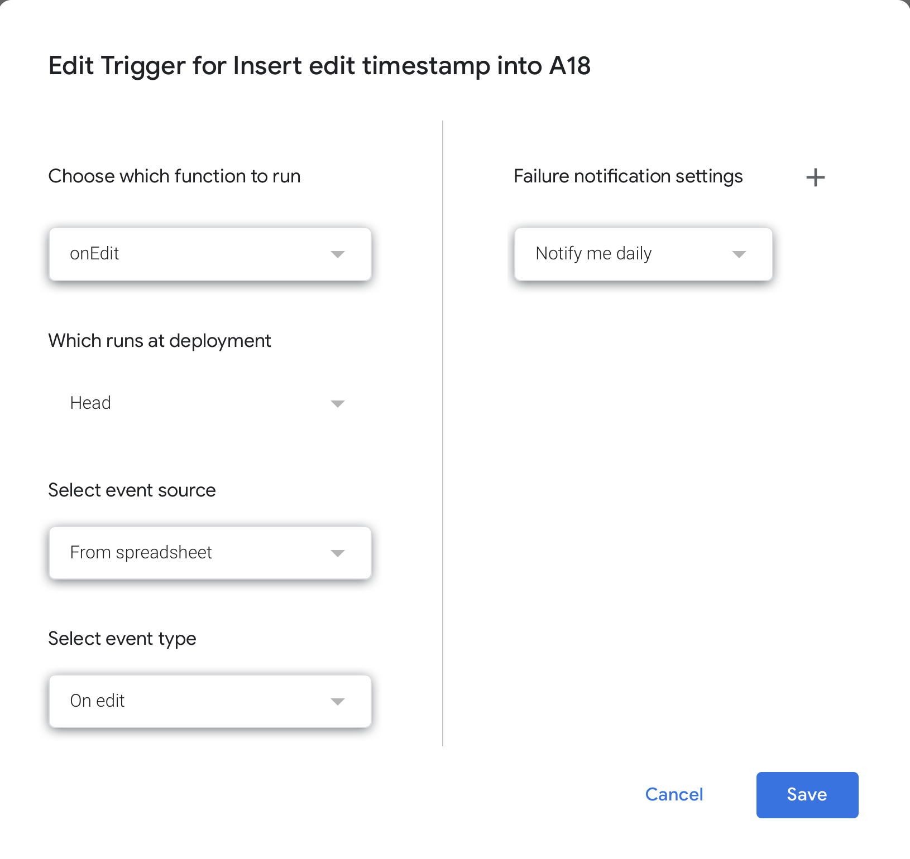

Connections to the SBML Level 3 Package spreadsheet
===================================================

The data about the current status of all the SBML Level 3 Packages is maintained as a [public Google spreadsheet](https://docs.google.com/spreadsheets/d/1pa01Z72t1UKrjliAXBhxjjN1nnOf00gXcfm4_pWXOxA/edit#gid=0).  The data from that spreadsheet is used to populate some parts of the SBML.org pages, particularly in the [sections about SBML Level&nbsp;3 packages](/documents/specifications/#sbml-level-3-packages).  This page describes how the connection between the SBML.org static site and the spreadsheet is established and maintained.


Adding a timestamp to the spreadsheet
-------------------------------------

Every time the Google spreadsheet is modified, a timestamp is written to a cell in the spreadsheet.  Here is how that is achieved.  The Google spreadsheet itself has a script attached to it.  This script is accessed by the _Script Editor_ item under the _Tools_ menu.  The following is the content of that script:

```javascript
function onEdit(e){
  let sheetName = "Sheet1";
  let cellAddress = "A18:A18";
    
  let editDate = new Date();
  let sheet = SpreadsheetApp.getActiveSpreadsheet().getSheetByName(sheetName);
    
  sheet.getRange(cellAddress).setValue(editDate.toString())
}
```

This script was added to the spreadsheet as follows: open the Google Script Editor (menu item _Tools_ ➜ _Script Editor_ in the Google spreadsheet, paste the code above into the editor, and save it.  To make the script get triggered properly, it is apparently also necessary to do the following: from the Script Editor, select the _Edit_ ➜ _Current project's triggers_ menu item and in the dialog that is shown, set up this script (`onEdit`) with the event type "On edit".  Here is a screenshot of that configuration:

<p align="center">

</p>


Using the timestamp to detect changes to the spreadsheet
--------------------------------------------------------

The timestamp is used in a process running on the SBML.org server to determine whether the data on SBML.org should be refreshed.  This process is started by the [`server-control`](../../admin/server-control) script in the [admin](../../admin) directory of the code repository for the site.  The process periodically checks the value of the timestamp remotely using a [`curl`](http://curl.haxx.se) command:

```bash
curl 'https://docs.google.com/spreadsheets/d/1pa01Z72t1UKrjliAXBhxjjN1nnOf00gXcfm4_pWXOxA/export?exportFormat=tsv&range=A18:A18'
```

If the last value of the timestamp is different from the most recent value, a copy of the spreadsheet data is downloaded and stored on the SBML.org server to replace the previous copy of the data.

